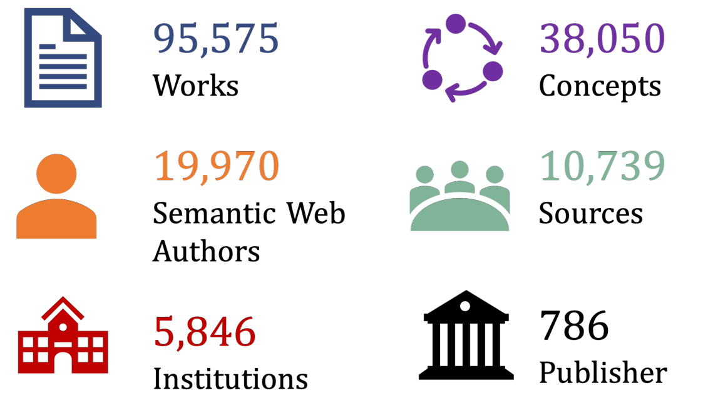

## SemOpenAlex-SemanticWeb

SemOpenAlex-SemanticWeb (SOA-SW) is a subset of [SemOpenAlex](https://semopenalex.org/) modelling the Semantic Web Community.
SOA-SW is a suitable databasis for creating graph benchmark datasets for GNN-based recommendation.

To create SOA-SW the following scripts must be executed (adjust file paths accordingly): 
* [01_create-author-list.py](./01_create-author-list.py)
* [02_filter-author-list-and-create-work-list.py](./02_filter-author-list-and-create-work-list.py)
* [03_create-semopenalex-semanticweb.py](./03_create-semopenalex-semanticweb.py)

To ensure its validity, SOA-SW contains only SemOpenAlex entities that meet the following conditions:
* Every author included has at least one semantic web paper published and between 3 and 200 papers published in total.
* From these authors only papers with an abstract, publication year >= 2005 and citation count >= 10 are included. If an semantic web author does not have a paper that meets these requirements the author is not modelled.

<figure>
    
    <figcaption>Overview of SemOpenAlex-SemanticWeb</figcaption>
</figure>

### Knowledge Graph Embeddings
The scripts for generating the Knowledge Graph Embeddings and the Evaluation Results of the different Knowledge Graph Embeddings Models are in the folder [embeddings-generation](./embeddings-generation).

